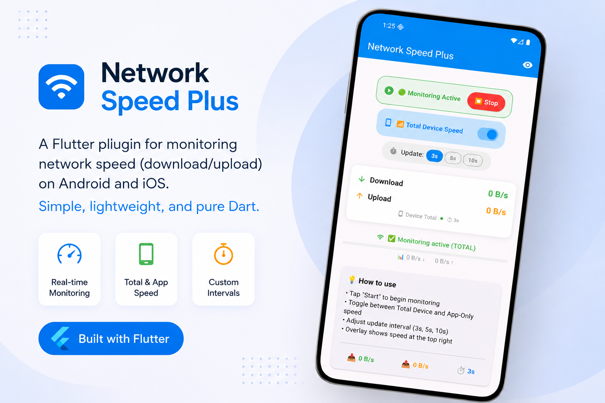

# network_speed_plus
# Network Speed Plus

A Flutter plugin for monitoring real-time upload and download network speed using Android TrafficStats and iOS network APIs.

## Screenshot

## Screenshot

## Features

✅ Real-time Upload/Download Monitoring

✅ Total Device Traffic Monitoring

✅ App-specific Traffic Monitoring

✅ Stream-based Updates

✅ Lightweight

✅ Android & iOS Support
